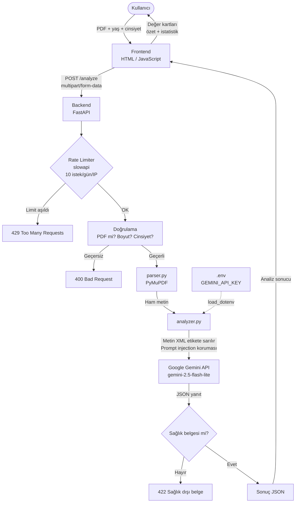

# Raporum 🏥

Kan tahlili ve sağlık raporlarını PDF olarak yükleyin, sade Türkçe açıklama alın.

> ⚠️ Bu uygulama tıbbi tavsiye vermez. Sonuçlarınızı mutlaka doktorunuzla değerlendirin.

---

## Ne Yapar?

- PDF formatındaki kan tahlili veya sağlık raporunuzu yüklersiniz
- Yapay zeka her değeri analiz eder
- Her değer için şunları gösterir:
  - Normal mi, dikkat gerektiriyor mu, yüksek mi, düşük mü?
  - Sade Türkçe açıklama
  - Doktorunuza sormanız gereken soru

---


## Teknolojiler

| Katman | Teknoloji |
|--------|-----------|
| Backend | Python, FastAPI |
| PDF Okuma | PyMuPDF |
| Yapay Zeka | Google Gemini 2.5 Flash Lite |
| Frontend | HTML, Tailwind CSS |

---

## Mimari



## Kurulum (Lokal)

### 1. Repoyu klonla
```bash
git clone https://github.com/kullaniciadin/raporum.git
cd raporum
```

### 2. Bağımlılıkları kur
```bash
cd backend
pip install -r requirements.txt
```

### 3. API anahtarını ayarla
`backend/` klasörüne `.env` dosyası oluştur:
```
GEMINI_API_KEY=buraya_api_keyini_yaz
```
Gemini API anahtarını [Google AI Studio](https://aistudio.google.com)'dan ücretsiz alabilirsin.

### 4. Çalıştır
```bash
uvicorn main:app --reload --port 8000
```

Tarayıcıda `http://localhost:8000` adresine git.

---

## Kullanım

1. Ana sayfada PDF yükleme alanına raporunu sürükle-bırak ya da "Dosya Seç" butonuna tıkla
2. Analiz birkaç saniye sürer
3. Her değer için renk kodlu kart görünür:
   - 🟢 Yeşil → Normal
   - 🟡 Sarı → Dikkat
   - 🔴 Kırmızı → Yüksek veya Düşük
4. "Yeni Rapor Yükle" butonu ile tekrar başlayabilirsin

---

## Geliştirici

**Tuna Mayir**
