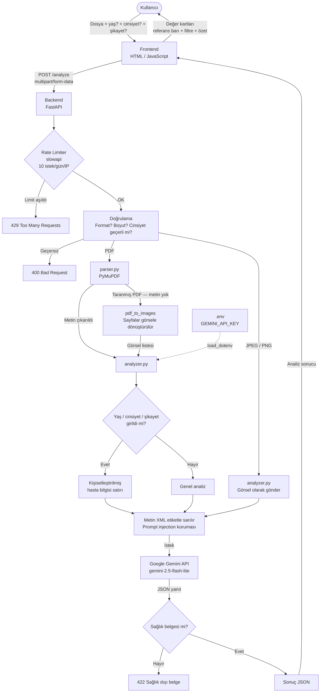

# Raporum 🏥

Kan tahlili ve sağlık raporlarını yükleyin; konsültan hekim denetimli yapay zeka analizi ile sade Türkçe açıklama alın.

> ⚠️ Bu uygulama tıbbi tavsiye vermez. Sonuçlarınızı mutlaka doktorunuzla değerlendirin.

---

## Ne Yapar?

- PDF, JPEG veya PNG formatındaki sağlık raporunuzu yüklersiniz
- Konsültan hekim kadrosu ve tıbbi yapay zeka her değeri birlikte inceler
- Her değer için şunlar gösterilir:
  - Normal mi, dikkat gerektiriyor mu, yüksek mi, düşük mü?
  - Referans aralığı görseli (bar/gauge)
  - Sade Türkçe açıklama
  - Olası nedenler ve belirtiler
  - Doktorunuza sormanız gereken soru
- Yaş, cinsiyet ve şikayetlerinize göre kişiselleştirilmiş analiz
- Dikkatli/anormal değerlere göre filtreleme

---


## Teknolojiler

| Katman | Teknoloji |
|--------|-----------|
| Backend | Python, FastAPI |
| PDF Okuma | PyMuPDF |
| Görsel İşleme | Pillow |
| Yapay Zeka | Google Gemini 2.5 Flash Lite |
| Frontend | HTML, Tailwind CSS |

---

## Mimari



## Kurulum (Lokal)

### 1. Repoyu klonla
```bash
git clone https://github.com/tunamyr/Raporum.git
cd Raporum
```

### 2. Bağımlılıkları kur
```bash
cd backend
pip install -r requirements.txt
```

### 3. API anahtarını ayarla
`backend/` klasörüne `.env` dosyası oluştur:
```
GEMINI_API_KEY=buraya_api_keyini_yaz
```
Gemini API anahtarını [Google AI Studio](https://aistudio.google.com)'dan ücretsiz alabilirsin.

### 4. Çalıştır
```bash
uvicorn main:app --reload --port 8000
```

Tarayıcıda `http://localhost:8000` adresine git.

---

## Kullanım

1. Yaş, cinsiyet ve şikayetlerini gir (isteğe bağlı)
2. PDF, JPEG veya PNG formatındaki raporunu sürükle-bırak ya da tıklayarak seç
3. "Analizi Başlat" butonuna bas
4. Her değer için renk kodlu kart görünür:
   - 🟢 Yeşil → Normal
   - 🟡 Sarı → Dikkat
   - 🔴 Kırmızı → Yüksek veya Düşük
5. Anormal değerleri filtrelemek için "Yalnızca dikkat edenler" butonunu kullan
6. "Yeni Rapor Yükle" butonu ile tekrar başlayabilirsin

---

## Geliştirici

**Tuna Mayir**
